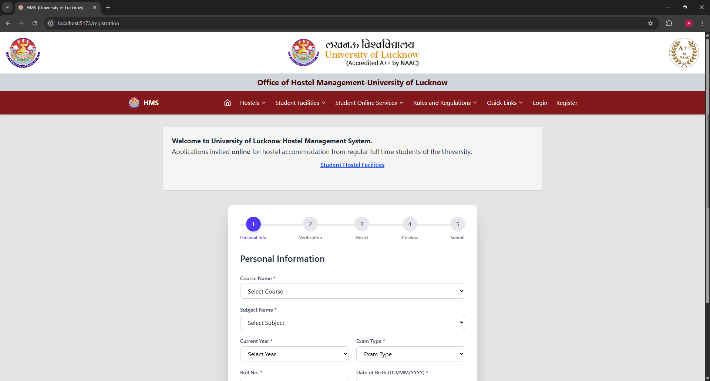
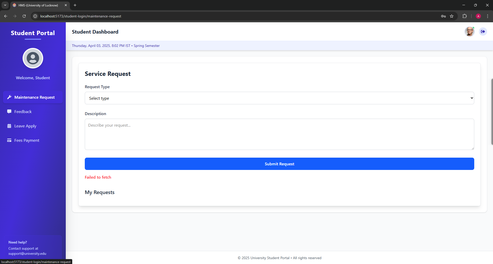
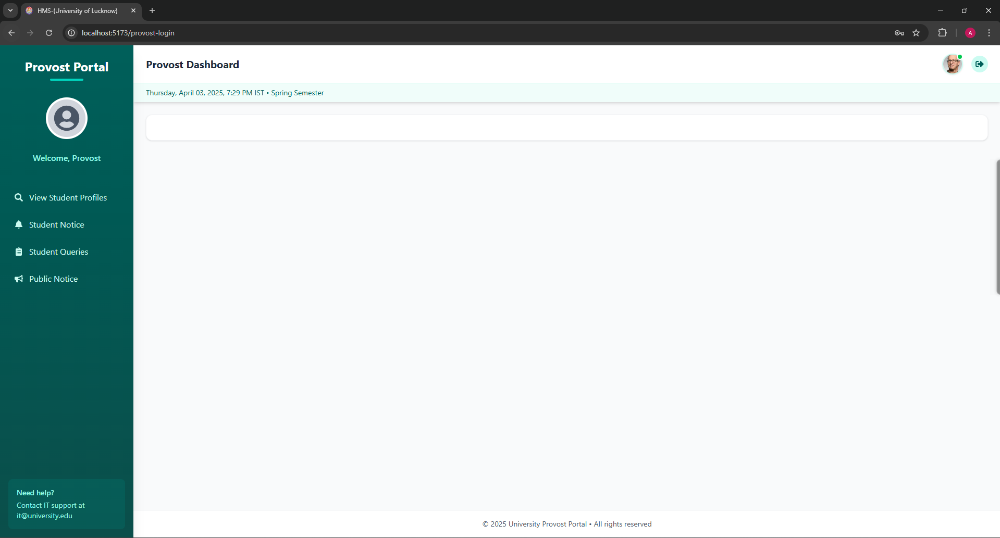
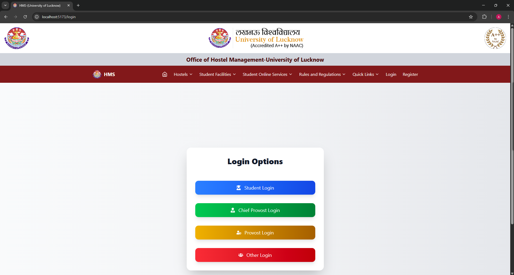

# Hostel Management System (Frontend)

Welcome to the **Hostel Management System (HMS)** frontend repository. This project is designed to streamline hostel management processes for the University of Lucknow, providing an intuitive interface for students, provosts, and administrators.

---

## Table of Contents

1. [Overview](#overview)
2. [Features](#features)
3. [Setup Instructions](#setup-instructions)
4. [Folder Structure](#folder-structure)
5. [Screenshots](#screenshots)
6. [Contributing](#contributing)
7. [License](#license)

---

## Overview

The **Hostel Management System (HMS)** frontend is a React-based web application that provides a user-friendly interface for managing hostel-related activities. It includes features like student registration, maintenance requests, feedback submission, leave applications, and more.

---

## Features

- **Student Dashboard**: Submit maintenance requests, leave applications, and feedback.
- **Provost Dashboard**: Manage student profiles, notices, and queries.
- **Public Notices**: Publish and manage notices for students.
- **Responsive Design**: Optimized for both desktop and mobile devices.
- **Secure Login**: Role-based login for students, provosts, and administrators.
- **Register Page**: A guided registration process for students to apply for hostel accommodation.

---

## Register Page

The **Register Page** provides a user-friendly interface for students to begin their hostel application process. It includes:

- **Instructions Section**: Clear guidelines on how to fill out the form.
- **Start Registration Button**: Redirects students to the multi-step registration form.
- **Responsive Design**: Optimized for both desktop and mobile devices.

### Screenshot



---

## Setup Instructions

Follow these steps to set up the project locally:

1. **Clone the Repository**:

   ````bash
   git clone https://github.com/amansinghnishad/Project-HMS.git
   cd Project-HMS/frontend
   ````

2. **Install Dependencies**:

   ````bash
   npm install
   ````

3. **Start the Development Server**:

   ````bash
   npm run dev
   ````

4. **Access the Application**:

   ```bash
   Open your browser and navigate to [http://localhost:5173](http://localhost:5173).
   ```

---

## Folder Structure

```
frontend/
├── public/               # Static assets (e.g., images, icons)
├── src/
│   ├── components/       # Reusable components (Navbar, Footer, etc.)
│   ├── pages/            # Application pages (Home, Login, Dashboard, etc.)
│   ├── App.jsx           # Main application component
│   ├── main.jsx          # Entry point for the React app
│   └── index.css         # Global styles
├── vite.config.js        # Vite configuration
├── package.json          # Project metadata and dependencies
└── README.md             # Documentation
```

---

## Screenshots

### 1. **Home Page**


### 2. **Student Dashboard**



### 3. **Provost Dashboard**



### 4. **Login Page**



### 5. **Register Page**


---

## Contributing

We welcome contributions to improve this project. To contribute:

1. Fork the repository.
2. Create a new branch for your feature or bug fix.
3. Commit your changes and push them to your fork.
4. Submit a pull request with a detailed description of your changes.

---

## License

This project is licensed under the [MIT License](https://opensource.org/licenses/MIT).

---

## Contact

For any queries or support, please contact:

- **Email**: [hostel.management@lkouniv.ac.in](mailto:hostel.management@lkouniv.ac.in)
- **Technical Support**: [Technical Support Team](mailto:techteam@lkouniv.ac.in)